# Lumina Engine

<div align="center">

  

  <br />
  <br />

  <h1>The Interface Layer for the Agentic Era</h1>
  
  <p style="font-size: 1.2em; max-width: 600px;">
    <b>Stop making your AI write HTML.</b>
    <br>
    Lumina turns "fuzzy" Agent thoughts into <br> 
    cinematic, 60fps GPU-accelerated experiences.
  </p>

  <p>
    <a href="#-quick-start"><strong>🚀 Quick Start</strong></a> · 
    <a href="#-layouts--gallery"><strong>🎨 Layout Gallery</strong></a> · 
    <a href="AGENTS.md"><strong>🤖 Agent Guide</strong></a>
  </p>

[](https://www.npmjs.com/package/lumina-slides)
[](https://www.npmjs.com/package/lumina-slides)
[](https://github.com/PailletJuanPablo/lumina-slides/blob/main/LICENSE)
[](https://www.typescriptlang.org/)

</div>

<br />

## 🔮 The Problem

<div align="center">
  <table>
    <tr>
      <td width="45%" align="center">
        <h3>❌ The Old Way</h3>
        <p>Models hallucinate HTML/CSS.</p>
        <p>Broken layouts.</p>
        <p>Ugly, non-responsive designs.</p>
        <p>Huge token cost.</p>
      </td>
      <td width="10%" align="center">👉</td>
      <td width="45%" align="center">
        <h3>✅ The Lumina Way</h3>
        <p>Model outputs <b>Intent</b> (JSON).</p>
        <p>Engine handles <b>Execution</b> (Renderer).</p>
        <p>Guaranteed 60fps & Responsive.</p>
        <p>Tiny token footprint.</p>
      </td>
    </tr>
  </table>
</div>

### Architecture

```mermaid
graph LR
    A[🤖 AI Agent] -->|Streams JSON| B(Lumina Engine)
    B -->|Normalizes| C{Layout System}
    C -->|Timeline| D[Render Slide]
    C -->|Flex| D
    C -->|Features| D
    D -->|60fps| E[✨ User Screen]
    E -->|Click Event| A
    style A fill:#e1f5fe,stroke:#01579b,stroke-width:2px
    style B fill:#e8f5e9,stroke:#2e7d32,stroke-width:2px,color:#000
    style E fill:#fff3e0,stroke:#ef6c00,stroke-width:2px
```



---

## 🎨 Layouts & Gallery

Lumina comes with **"Pro" Layouts** built-in. Your agent just needs to pick the `type`.

| Layout        | Description                                                                                                                   | Visual Preview                                                                                                            |
| :------------ | :---------------------------------------------------------------------------------------------------------------------------- | :------------------------------------------------------------------------------------------------------------------------ |
| **Statement** | High-impact text. Perfect for titles, big ideas, or "cover" slides. <br><br> `type: "statement"`                              |  |
| **Features**  | A powerful grid system for benefits, stats, or KPIs. Automatically adapts to the number of items. <br><br> `type: "features"` |   |
| **Timeline**  | Chronological events, roadmaps, or history. Horizontal scrolling with snap points. <br><br> `type: "timeline"`                |   |
| **Steps**     | Numbered process flows, tutorials, or "How-To" guides. <br><br> `type: "steps"`                                               |      |
| **Half**      | Visual context. Image on one side, text on the other. Responsive. <br><br> `type: "half"`                                     |       |
| **Chart**     | Data visualization with Chart.js. Bar, line, pie, doughnut charts. <br><br> `type: "chart"`                                   |      |
| **Embedded**  | **Widget Mode**. Embed slides inside dashboards or smaller containers. <br><br> `type: "features" (compact)`                  |   |

> [!TIP] > **See the Code**: Click on the dropdowns below to see the exact JSON used to generate these slides.

<details>
<summary><b>Example: Timeline JSON</b></summary>

```json
{
  "type": "timeline",
  "title": "Project History",
  "timeline": [
    {
      "date": "2023",
      "title": "Inception",
      "description": "The idea is born."
    },
    {
      "date": "2024",
      "title": "Launch",
      "description": "First public release."
    }
  ]
}
```

</details>

<details>
<summary><b>Example: Chart JSON</b></summary>

```json
{
  "type": "chart",
  "chartType": "bar",
  "title": "Quarterly Revenue",
  "data": {
    "labels": ["Q1", "Q2", "Q3", "Q4"],
    "datasets": [
      { "label": "Revenue", "values": [120, 150, 180, 220], "color": "c:p" }
    ]
  }
}
```

</details>

---

## 🎭 Theming

Lumina includes **6 beautiful theme presets** out-of-the-box. Just pass the name:

```typescript
const engine = new Lumina("#app", { theme: "ocean" });
```

| Theme        | Description                         | Preview                                                                                                                 |
| :----------- | :---------------------------------- | :---------------------------------------------------------------------------------------------------------------------- |
| **default**  | Clean blue on dark. Professional.   |   |
| **ocean**    | Cyan on slate. Calm and focused.    |     |
| **midnight** | Indigo on black. Bold and dramatic. |  |
| **forest**   | Emerald greens. Natural and fresh.  |    |
| **cyber**    | Neon pink. Sci-fi futuristic.       |     |
| **latte**    | Light mode. Warm amber on cream.    |     |

---

## ⚡ Quick Start

### 1. Install

```bash
npm install lumina-slides
```

### 2. Implementation

Lumina is a **Framework Agnostic** class. It mounts to any DOM node.

```typescript
import { Lumina } from "lumina-slides";
import "lumina-slides/style.css";

const engine = new Lumina("#app", {
  theme: "dark",
  loop: true,
});

// Load Data (From your API, or static)
engine.load({
  meta: { title: "Demo Deck" },
  slides: [
    { type: "statement", title: "Hello World", subtitle: "Powered by Lumina" },
  ],
});
```

---

## 🤖 Building Agents?

We have a dedicated guide for that.

> [!IMPORTANT] > **Read the [Agent Integration Guide](./AGENTS.md)**
>
> Learn about:
>
> - **Streaming**: How to pipe token streams directly into the engine.
> - **Aliases**: Improve latency by 30% using `t` instead of `title`.
> - **Feedback Loops**: How to let the AI know what the user is clicking.

### Token Optimization

Lumina includes a built-in normalizer. Your LLM can output "lazy" JSON to save money.

| Concept        | Standard     | Short Alias |
| :------------- | :----------- | :---------- |
| **Header**     | `title`      | `t`         |
| **Sub-Header** | `subtitle`   | `s`         |
| **Picture**    | `image`      | `img`       |
| **Background** | `background` | `bg`        |

---

## 🛠 API Reference

### `engine.load(deck)`

Replaces the entire deck. Use this for the initial load.

### `engine.patch(diff)`

Updates **parts** of the deck. Use this for:

- Real-time streaming (appending slides).
- Correcting typos live.
- Updating a "Status" slide based on live data.

### `engine.on(event, handler)`

Listen to user behavior.

- `action`: User clicked a button.
- `slideChange`: User navigated.

```typescript
engine.on("action", (e) => {
  // e.value = "buy_now_clicked"
  // Tell the Agent to proceed to checkout!
});
```

---

<div align="center">
  <p>Built with ❤️ by <a href="https://pailletjp.com">Juan Pablo Paillet</a>.</p>
</div>
